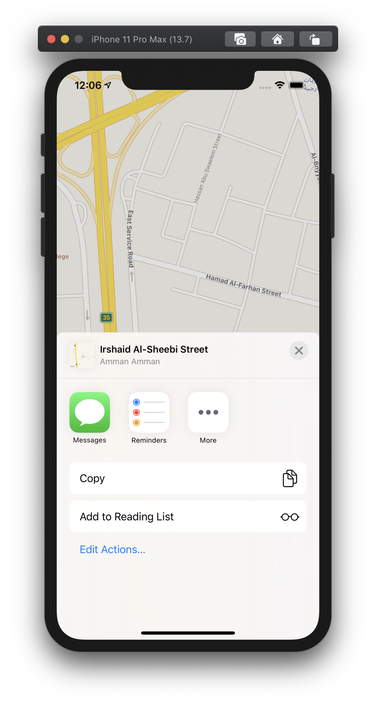

# MapApp

## frameworks
* CoreData
* MapKit
* CoreLocation

## Operations
* tracking user location
* share Locations
* save & delete locations

### How it works
the user can save location by press long in the locations he/she want in the map to display a pin, then press on the pin to see the view with the location details and two buttons:
* Share
to share the location by send, post or copy it
* Save or Delete
to save the location with title but if the location already saved Delete button will appear instead of save one to delete this saved location

### Screenshots
#### Current Location

#### Save Location
  
  

#### Share Location
 
